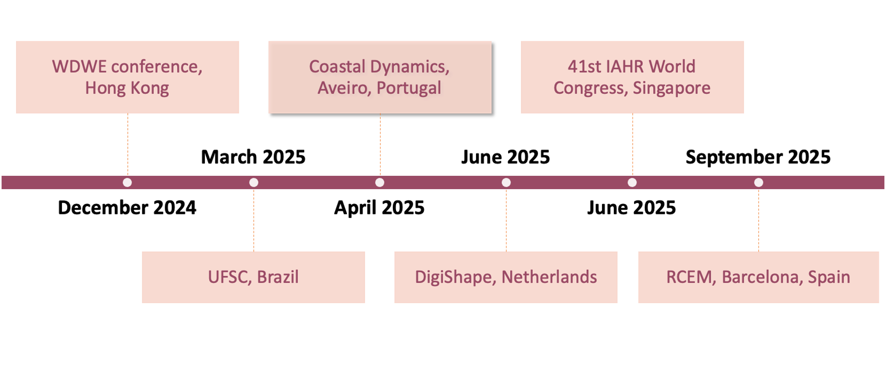

# BlueMath

BlueMath is an open-source Python repository designed for the development of both numerical and statistical projects, with the flexibility to operate in a hybrid mode when both approaches are used simultaneously.

At its core lies an open-source package called [BlueMath-tk](https://github.com/GeoOcean/BlueMath_tk), which includes a wide range of tools; from data mining statistical models to wrappers for numerical models. These tools allow users to easily combine both statistical and numerical methods.

BlueMath is designed to be cross-platform and highly efficient when running in the cloud. This enables users to conduct rapid testing in cloud environments like GitHub DevContainers, etc., and run complex metamodels locally or on computing clusters, thanks to generalized parallelization functions.

As shown in Figure 1, this repository provides examples of how to use the core toolkit and how to combine its components to create more complex metamodels (referred to as methods) or climate services.

## Courses

## Funding

1. Internal project at the GeoOcean group, University of Cantabria.
2. Specific Projects that partially support the development of BlueMath.

## History

During the last 10 years the GeoOcean research group of University of Cantabria has been developing tools, methods and frameworks for ocean, coastal and hydraulic engineers and scientists.  In terms of the computational environment, and as many research groups, there has been a transition between Matlab and Python.

The Python ecosystem (Jupyter Notebooks, Jupyter Books, Jupyter Hub, Visual Studio Code) offers an open source, transparent and efficient system for running the processes in local computers, private and public HPCs. Besides, the visualization of the notebooks facilitates the interaction with the computer, being nowadays a new standard for teaching, for sharing  and exchanges tools, methods and frameworks.

In September 2020, during COVID pandemic, a virtual workshop leaded by NOAA (PI John Marra) attended by researchers of Spain (University of Cantabria), USA (OSU, SCRIPPS, USGS, FIU, Univ. Hawaii, Duke University), Australia (CSIRO), Fiji (SPC), New Zealand (Uni. of Auckland) was held presenting the idea of a Library of tools, methods and frameworks. This community model library was named BlueMath, aiming for an integration of: (a) existing coastal and ocean engineering practice (methods, data, numerical models); (b) data science (statistics, data mining, artificial intelligence); and (c) climate (seasonality, interannual variability, climate variability, climate change).

BlueMath aims to provide tools (toolkit), methods (hybrid downscaling, statistical downscaling, dynamical downscaling) and climate services (short-term forecast, seasonal forecast, hindcast, probabilistic assessment, climate variability, climate change) for addressing problems at different spatial scales (global, regional, local, high resolution) involving different physical processes (wind, waves, storm surge, tropical cyclones, sea level, morphodynamics,…).

Since the workshop in 2020, more universities has been interested in collaborating in the development of this community model BlueMath: UFSC (Brazil), TU Delft (Netherlands), UCSC (USA), ERDC (USA), IFCA (Spain). The collaboration of these institutions with the GeoOcean group of the University of Cantabria is being carried out through different mechanisms (sharing data bases, computer codes and methodologies, co-op agreements, consultancy projects, research projects, exchange of researchers).

## Tips

If `bluemath-tk` package is not recognized in a notebook:
- Open VSCode pallette command (Ctrl + Shift + P o Cmd + Shift + P in macOS) and select: **Python: Restart Language Server**.